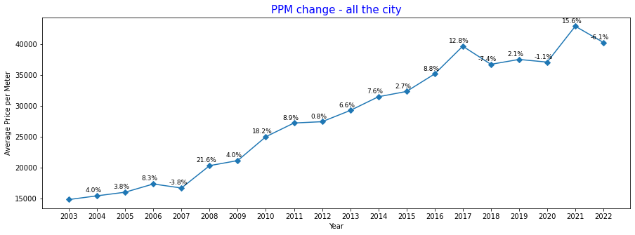
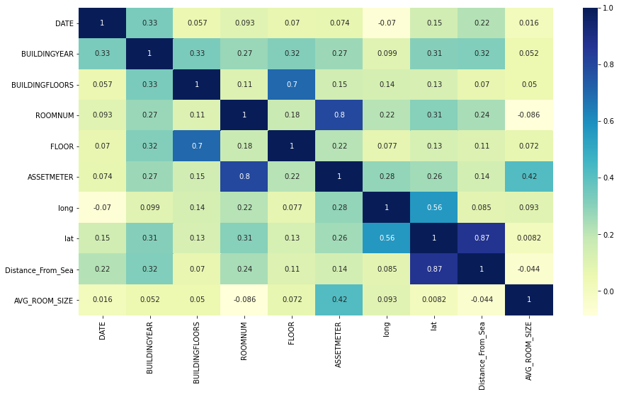
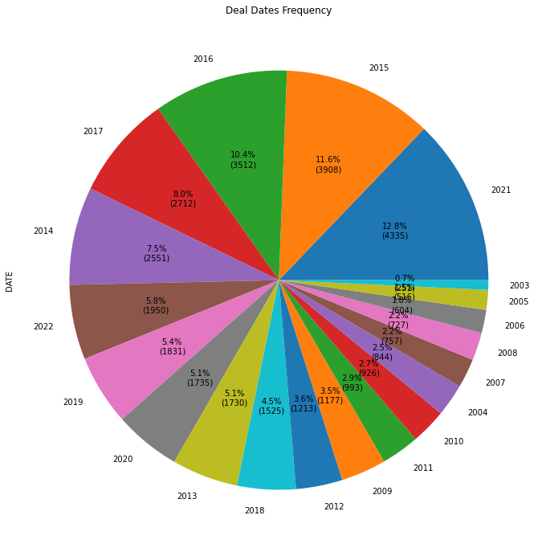
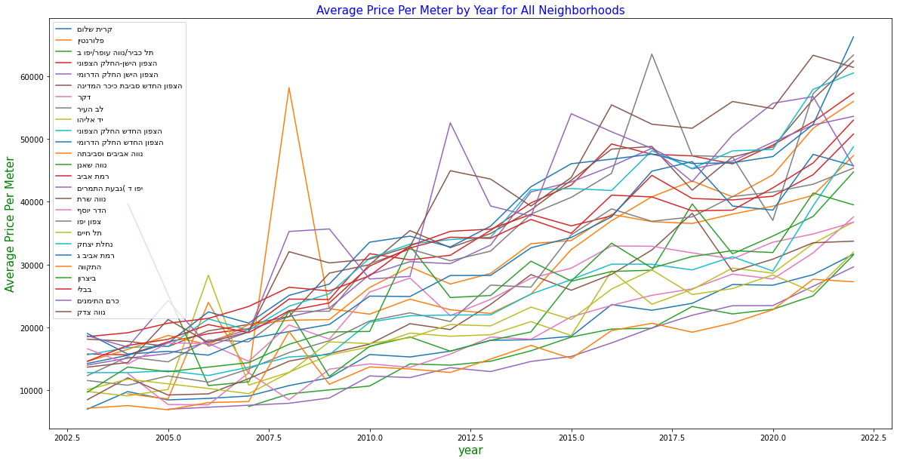
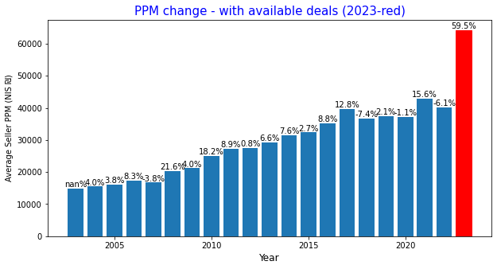

# RealEstateTLV

Welcome to the Real Estate TLV project! Our aim is to provide a comprehensive platform for finding real estate properties in Tel Aviv, Israel. Whether you're a potential homeowner or an investor, this project offers something for everyone.

 
 
 
www.govmap.gov.il - a government website that provides access to real-estate transactions in Israel dating back to 1998.

www.nadlan.gov.il - a government site that offers additional information on real-estate transactions in Israel.

www.yad2.co.il - a popular Israeli website where individuals, brokers, and real-estate companies advertise their properties for sale.

Project Development
The project was developed in several stages:

**1. Data collection** - The data was collected from the three sources mentioned above through crawling and using an external API. The information was divided into three tables: nadlan, govmap, and yad2.

**2. Data cleaning** - Irrelevant data was removed from the govmap and nadlan tables, such as parking lots, shops, land, etc. The yad2 table was cleaned of transactions without prices, unreliable prices, and transactions from companies.

**3. Data unification** - The data from govmap and nadlan was unified to provide more information on each transaction.

**4. Data analysis** - Data visualization was used to research and analyze the data, assess its reliability and quality.

**5. Machine learning** - The RandomForestRegressor model was used to produce reliable results.

**6. Model testing** - The existing model was run on new transactions in the market (yad2) to identify the most profitable transactions.

**Place for Improvement**
**The current model has some limitations and places for improvement, including:

Inaccurate prediction of transaction values - This is due to:
A. The model being learned on outdated transactions, leading to a large discrepancy in results.

Solution: Running the model on the most recent transactions.

B. The data on real estate transactions taking time to be updated on government websites.

Solution: Checking the percentage increase of real estate in the last year and incorporating it into the model's view.

C. The difference between the advertised price and the closing price of the deal.

Solution: Checking the difference and entering it manually in the model.

Overall, the Real Estate TLV project provides a comprehensive platform for finding and analyzing real estate properties in Tel Aviv, Israel. We are continuously working to improve the accuracy and reliability of our results.
 

 

**Requirements**
To run this project, you will need:
Python 3.7 or higher
Jupyter Notebook
Pandas, Numpy, Matplotlib, and Seaborn libraries

**Installation**
The Real Estate TLV project is a web-based application and can be accessed directly from your browser. No downloads or installations are required.

img/DealFr.png

Contribution
We welcome contributions to the Real Estate TLV project! If you have an idea for a new feature, or if you've found a bug that needs to be fixed, please open a new issue in the GitHub repository. We appreciate your help
